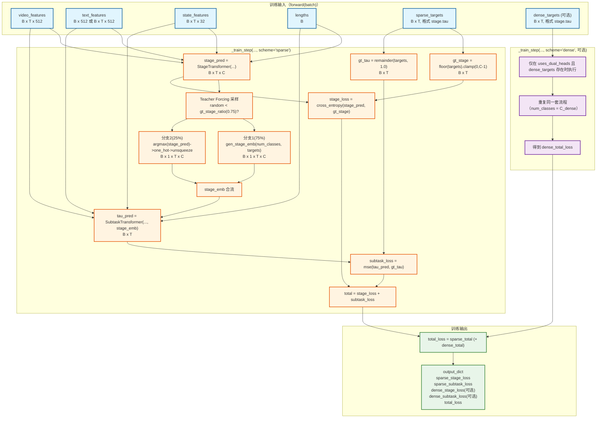

# SARM Reward Model 完整架构图（细粒度版）

这篇论文提出了一种名为 SARM (Stage-Aware Reward Modeling) 的分阶段奖励建模框架，旨在解决长时序、接触式机器人操作任务（如处理可变形物体）中示教数据质量不一致的问题。现有方法在处理 T 恤折叠这类任务时，由于示教轨迹长度和动作序列差异大，难以提供稳定、泛化的监督信号。传统的基于帧索引的奖励标注方法在这些任务中会引入严重的标签噪声。

为了克服这些挑战，SARM 引入了一种阶段感知的、基于视频的奖励建模方法。它能够联合预测高层任务阶段和每个阶段内的精细化进度。奖励标签不是通过简单的帧索引生成，而是自动从自然语言子任务标注中推导，确保了在可变长度和异构示教数据之间进度估计的一致性。这种设计克服了基于帧索引标注的局限性，使得奖励信号能更好地反映任务的语义进展。

基于 SARM，论文进一步提出了 RA-BC (Reward-Aligned Behavior Cloning) 框架。RA-BC 利用 SARM 学习到的奖励模型来识别高质量的示教数据，并根据奖励估计重新加权训练样本。这使得行为克隆策略能够专注于从更有效、更接近专家水平的示范中学习，从而在噪声或次优示范数据存在的情况下，显著提高策略训练的鲁棒性和性能。

**核心方法和技术细节：**

1.  **奖励模型训练 (Reward Model Training):**
    *   **数据处理 (Data Processing):** 针对长时序任务中帧索引标注的问题，SARM 采用了基于自然语言子任务标注的方式。首先，通过将任务分解为语义上有意义的子任务（例如 T 恤折叠的“抓取”、“展平”、“折叠”等），并标注每个子任务的开始和结束帧。然后，计算每个子任务在整个数据集中的平均时间比例 $\bar{\alpha}_k = \frac{1}{M}\sum_{i=1}^M \frac{L_{i,k}}{T_i}$，其中 $L_{i,k}$ 是轨迹 $i$ 中子任务 $k$ 的长度，$T_i$ 是轨迹 $i$ 的总长度，$M$ 是轨迹数量。帧级别的进度目标 $y_t$ 通过对子任务内的帧索引进行线性插值得到：$y_t = P_{k-1} + \bar{\alpha}_k \tau_t$，其中 $\tau_t = \frac{t - s_k}{e_k - s_k}$ 是子任务内的归一化时间，$s_k, e_k$ 是子任务的开始和结束帧，$P_k = \sum_{j=1}^k \bar{\alpha}_j$ 是累积时间比例。这种方法确保了即使在轨迹长度和动作序列不同的情况下，相同语义阶段的进度估计也能保持一致。
    *   **模型架构 (Model Architecture):** SARM 采用双奖励模型架构，包含一个阶段估计器 (Stage Estimator) 和一个子任务估计器 (Subtask Estimator)，共享一个骨干网络。
        *   输入管道：序列的 $N$ 张 RGB 图像通过一个冻结的 CLIP 编码器编码，生成视觉嵌入。视觉嵌入和关节状态被投影到统一的 $d_{model}$ 维度空间。仅第一帧接收显式的位置偏置，以防止绝对时间泄漏。
        *   Transformer 序列聚合器 (Transformer Sequential Aggregator)：多模态序列随后由 Transformer 编码器处理，以捕获时间依赖性和跨模态交互。
        *   输出头：一个轻量级 MLP 头融合聚合的特征并输出。阶段模型输出离散任务阶段的概率分布 $\hat{\Pi}_{1:N} = \text{softmax}(\hat{\Psi}_{1:N}) \in [0, 1]^{N \times k}$，并进行离散阶段预测 $\hat{S}_{1:N} = \text{argmax}_{i \in \{1,...,k\}} \hat{\Pi}_{1:N,i}$。子任务模型则在预测阶段的条件下，输出一个连续的进度值 $\hat{\tau}_{1:N} \in [0, 1]^N$，最终的归一化进度 $\hat{y}_{1:N} = \hat{P}_{k-1, 1:N} + \bar{\alpha}_{k, 1:N} \hat{\tau}_{1:N}$。
        *   训练细节：阶段模型使用交叉熵损失训练，子任务模型使用均方误差 (MSE) 损失优化。为了增强时间多样性并更好地捕获失败情况，模型还采用了 Rewind 增强策略，将之前时间戳的倒序帧附加到每个训练序列的末尾。

2.  **奖励对齐行为克隆 (RA-BC - Reward-Aligned Behavior Cloning):**
    *   RA-BC 通过引入一个奖励对齐的加权机制，替代了标准行为克隆 (BC) 目标中的均匀权重。
    *   标准 BC 目标函数：$L_{BC}(\theta) = \frac{1}{N}\sum_{i=1}^N \ell(\pi_\theta(o_i), a_i)$。
    *   RA-BC 目标函数：$L_{RA-BC}(\theta) = \frac{\sum_{i=1}^N w_i \ell(\pi_\theta(o_i), a_i)}{\sum_{i=1}^N w_i + \epsilon}$。
    *   权重计算：对于每个训练样本 $i$，计算其进步增量 $b_i = \phi(o_{t+\Delta}^i) - \phi(o_t^i)$，其中 $\phi(\cdot) \in [0, 1]$ 是奖励模型预测的归一化进度分数，$o_t^i$ 是当前窗口结束时的观察，$o_{t+\Delta}^i$ 是前进一个动作块后的观察。这个 $b_i$ 作为一个预期改进的标量信号。
    *   权重校准：通过在线运行统计量 (均值 $\mu$ 和标准差 $\sigma$) 校准 $w_i$，将 $b_i$ 映射到软权重 $\tilde{w}_i = \text{clip}\left(\frac{b_i - (\mu - 2\sigma)}{4\sigma + \epsilon}, 0, 1\right)$。
    *   先验覆盖 (Prior Overrides)：引入阈值 $\kappa > 0$，对明显好的或坏的样本赋予决定性权重：$w_i = \mathbb{1}_{\{b_i > \kappa\}} + \mathbb{1}_{\{0 \le b_i \le \kappa\}} \tilde{w}_i$。如果 $b_i > \kappa$，权重为 1；如果 $0 \le b_i \le \kappa$，权重为软权重；如果 $b_i < 0$，权重为 0。这使得 RA-BC 能够选择性地强调高质量片段，并降低次优片段的权重。

**实验结果：**

论文通过 T 恤折叠任务（一项长时序、多阶段、接触式操作任务）和碗碟卸载任务进行了验证。
1.  **SARM 评估：** SARM 在人类示教数据和真实机器人策略 Rollout 评估中，均显著优于现有基线（如 LIV, VLC, GVL, ReWiND）。在 T 恤折叠任务中，SARM 比最强基线 ReWiND 在人类示教基准上提高了 50% 以上，在真实机器人 Rollout 上提高了 80% 以上。消融实验表明，阶段感知设计、语言标注数据、Rewind 增强、关节状态输入、适当的观察步数和帧间隔对于 SARM 的鲁棒性和泛化能力至关重要。
2.  **RA-BC 策略学习：**
    *   在 T 恤折叠任务中，RA-BC-SARM 策略在从展平状态折叠 T 恤的 Medium 任务中达到了 83% 的成功率，在从揉皱状态开始的 Hard 任务中达到了 67% 的成功率。
    *   相比之下，在相同训练数据集下，香草行为克隆 (Vanilla BC) 仅达到 8% 和 0% 的成功率。
    *   结果表明，RA-BC 能够有效利用多样化数据集，通过过滤高质量数据帧，使得策略学习到鲁棒的长时序操作策略。
3.  **奖励模型质量的影响：** 论文对比了使用 ReWiND 奖励模型和 SARM 奖励模型进行 RA-BC 训练的效果。结果显示，奖励模型的质量对 RA-BC 的性能至关重要。SARM 的高准确性使其能够有效过滤数据并提供一致的监督，而一个糟糕的奖励模型则会误判进度、错误加权数据，从而削弱过滤效果，导致策略性能下降。
4.  **强化学习 (RL) 示例：** 论文还展示了将 SARM 与强化学习（使用 DiffQL 算法）结合的潜力。在抓取方块任务中，与纯行为克隆相比，使用 SARM 提供的奖励信号进行微调的 RA-QL 策略在成功率和折扣回报方面均表现出更好的性能。

**结论：**
论文强调了奖励建模在长时序机器人操作中作为可扩展、标注高效和鲁棒模仿学习的关键推动力。SARM 通过将自然语言标注转换为结构化的进度信号，实现了对任务进展的可靠估计，而 RA-BC 则利用这些信号强调高价值轨迹进行训练。这些贡献为构建能够处理复杂长时序操作挑战的鲁棒、可扩展的机器人行为模型奠定了基础。

根据论文的实验分析，作者研究了不同模型规模对 **SARM** 奖励模型性能的影响。

### SARM 的层数与参数量
作者通过改变时间聚合器（Temporal Aggregator）中 **Transformer** 的层数，对比了三种不同规模的配置：

1.  **4 层**：对应参数量约为 \(30\text{M}\)。这一规模表现出明显的欠拟合（Underfitting），在各项评估指标上表现较差 。
2.  **8 层（论文最终采用的配置）**：对应参数量约为 \(60\text{M}\)。将层数从 4 层增加到 8 层带来了显著的性能提升 。
3.  **12 层**：对应参数量约为 \(90\text{M}\)。实验发现，进一步增加到 12 层仅能带来微乎其微或可以忽略不计的改进，且在大模型上存在过拟合（Overfitting）训练数据的风险 。

### 结论
作者最终选择了 **8 层 Transformer** 的配置，认为该规模在模型容量（Capacity）与计算效率（Computational Efficiency）之间达到了最佳平衡，足以捕捉 T-shirt 折叠等长程任务的动态特征 。

### 进一步思考与验证
*   **隐藏层维度**：除了层数，该模型还采用了 \(12\) 个注意力头（Attention Heads）和 \(768\) 的隐藏层维度（Hidden Dimension） 。
*   **输出头结构**：在 Transformer 主干网络之上，还包含两个轻量级的 MLP 输出头（Stage Model 和 Subtask Model），每个输出头由 \(2\) 层组成，隐藏维度为 \(512\) 。

## 0) SARM 模型缩减图（类似论文总览风格）

只保留 `SARMRewardModel` 内部最核心的两部分：`StageTransformer` 和 `SubtaskTransformer`。

```mermaid
graph LR
    subgraph Inputs["Inputs"]
        V["Video Embeddings<br/>B x T x 512"]
        L["Text Embeddings<br/>B x 512 或 B x T x 512"]
        S["State Features<br/>B x T x 32"]
        LEN["Valid Lengths<br/>B"]
    end

    PRE["预处理/重排<br/>img_seq = video.unsqueeze(1)<br/>B x 1 x T x 512<br/>state pad 到 max_state_dim"]

    subgraph StageTower["StageTransformer（阶段判别）"]
        ST_IN["输入<br/>img_seq + lang + state + lengths"]
        ST_CORE["主作用<br/>预测当前帧属于哪个 stage"]
        ST_OUT["输出<br/>stage_logits: B x T x C<br/>stage_probs: B x T x C<br/>stage_idx: B x T"]
    end

    BRIDGE["Stage Bridge<br/>stage_idx -> one_hot -> stage_emb<br/>B x 1 x T x C"]

    subgraph SubtaskTower["SubtaskTransformer（阶段内进度回归）"]
        SU_IN["输入<br/>img_seq + lang + state + lengths + stage_emb"]
        SU_CORE["主作用<br/>在当前 stage 内回归 tau"]
        SU_OUT["输出<br/>tau_pred: B x T（范围 [0,1]）"]
    end

    REWARD["Reward Compose<br/>raw = stage_idx + tau_pred<br/>normalize_stage_tau -> reward in [0,1]"]
    FINAL["最终输出<br/>单帧或全帧 reward<br/>可选返回 stage_probs/confidence"]

    V --> PRE
    L --> PRE
    S --> PRE
    LEN --> PRE
    PRE --> ST_IN --> ST_CORE --> ST_OUT --> BRIDGE --> SU_IN --> SU_CORE --> SU_OUT --> REWARD --> FINAL

    classDef input fill:#e1f5fe,stroke:#01579b,stroke-width:2px
    classDef stage fill:#fff4e1,stroke:#e65100,stroke-width:2px
    classDef subtask fill:#f3e5f5,stroke:#6a1b9a,stroke-width:2px
    classDef out fill:#e8f5e9,stroke:#2e7d32,stroke-width:2px

    class V,L,S,LEN input
    class ST_IN,ST_CORE,ST_OUT stage
    class SU_IN,SU_CORE,SU_OUT subtask
    class REWARD,FINAL out
```

### 缩减图解读（只看核心）

- `StageTransformer`：输入是视觉/语言/状态序列，输出每一帧所属阶段分布（`stage_probs`）与阶段索引（`stage_idx`）。
- `SubtaskTransformer`：在 `stage_emb` 条件下回归每一帧阶段内进度 `tau_pred`，表示“在当前阶段完成到哪里”。
- 最终 reward：`stage_idx + tau_pred` 后再做 `normalize_stage_tau`，得到范围 `[0,1]` 的可比较进度值。
- 这个结构对应代码里的主推理路径：`calculate_rewards()` 内先跑 `stage_model`，再构建 `stage_emb`，再跑 `subtask_model`，最后归一化输出。

## 默认配置速览（来自 `SARMConfig`）

- `image_dim=512`, `text_dim=512`, `hidden_dim=768`
- `num_layers=8`, `num_heads=12`, `dropout=0.1`
- `n_obs_steps=8`, `max_rewind_steps=4`, 所以 `num_frames=13`
- `max_state_dim=32`
- 主网络共 2 个：`StageTransformer` + `SubtaskTransformer`

## 1) 端到端总图（Processor -> Reward）

```mermaid
graph TB
    subgraph Input["输入层 Input"]
        I1["原始图像 observation[image_key]<br/>B x T_raw x C x H x W"]
        I2["机器人状态 observation[state_key]<br/>B x T_raw x D_state_raw"]
        I3["任务文本 complementary_data.task<br/>string 或 list[string]"]
        I4["索引 complementary_data.index / episode_index"]
        I5["dataset_meta + episodes_df<br/>subtask 注释与 episode 边界"]
    end

    subgraph PrePipeline["Policy Preprocess Pipeline"]
        P1["AddBatchDimensionProcessorStep"]
        P2["RenameObservationsProcessorStep"]
        P3["NormalizerProcessorStep"]
        P4["SARMEncodingProcessorStep"]
        P5["DeviceProcessorStep"]
    end

    subgraph Processor["SARMEncodingProcessorStep（训练数据构建）"]
        S0["序列长度构建<br/>total_frames = 1 + n_obs_steps + max_rewind_steps = 13"]
        S1["rewind增强 (p=0.8, 训练时)<br/>rewind_steps: B"]
        S2["有效长度<br/>lengths = (1+n_obs_steps) + rewind_steps<br/>shape: B"]
        S3["图像mask<br/>超过 valid_len 的帧置零"]
        S4["CLIP视觉编码<br/>openai/clip-vit-base-patch32<br/>get_image_features"]
        S5["video_features<br/>B x 13 x 512"]

        S6["状态预处理<br/>pad_state_to_max_dim(..., 32)"]
        S7["state_features<br/>B x 13 x 32"]

        S8["文本扰动 (p=0.2, 训练时)<br/>perturbed task 或原任务"]
        S9["CLIP文本编码<br/>get_text_features + expand(batch)"]
        S10["text_features<br/>B x 512"]

        S11["target生成 sparse_targets<br/>find_stage_and_tau -> stage.tau<br/>B x 13"]
        S12["target生成 dense_targets (dual/dense_only)<br/>B x 13"]
    end

    subgraph RewardModel["SARMRewardModel (推理 calculate_rewards)"]
        R0["输入<br/>video_embeddings B x T x 512<br/>text_embeddings B x 512 或 B x T x 512<br/>state_features B x T x 32<br/>lengths B"]
        R1["重排图像<br/>img_seq = video.unsqueeze(1)<br/>B x N x T x 512, N=1"]
        R2["state pad 到 max_state_dim=32"]

        subgraph StageTower["StageTransformer（阶段分类塔）"]
            ST1["visual_proj: Linear(512->768)<br/>B x N x T x 768"]
            ST2["lang_proj: Linear(512->768)<br/>B x 1 x T x 768"]
            ST3["state_proj: Linear(32->768)<br/>B x 1 x T x 768"]
            ST4["concat streams<br/>[camera, lang, state]<br/>B x (N+2) x T x 768"]
            ST5["first_pos 加到首帧视觉token<br/>x[:, :N, 0, :] += first_pos"]
            ST6["flatten tokens<br/>B x ((N+2)*T) x 768"]
            ST7["mask构建<br/>padding mask from lengths<br/>causal mask: upper-tri bool"]
            ST8["TransformerEncoder<br/>8 layers, 12 heads"]
            ST9["reshape + fusion_backbone<br/>LayerNorm((N+2)*768)->Linear->ReLU<br/>输出 B x T x 768"]
            ST10["head选择<br/>sparse: Linear(768->C_sparse)<br/>dense: Linear(768->C_dense)"]
            ST11["stage_logits<br/>B x T x C"]
        end

        BR1["softmax(stage_logits)<br/>stage_probs: B x T x C"]
        BR2["argmax -> stage_idx<br/>B x T"]
        BR3["stage_conf = gather(prob, stage_idx)<br/>B x T"]
        BR4["one_hot(stage_idx)<br/>B x T x C -> unsqueeze -> B x 1 x T x C"]

        subgraph SubtaskTower["SubtaskTransformer（阶段内进度塔）"]
            SU1["visual/lang/state 线性投影 -> 768"]
            SU2["stage_prior 映射<br/>_stage_to_dmodel: pad/truncate C->768<br/>B x 1 x T x 768"]
            SU3["concat streams<br/>[camera, lang, state, stage_emb]<br/>B x (N+3) x T x 768"]
            SU4["first_pos 到首帧视觉token"]
            SU5["flatten<br/>B x ((N+3)*T) x 768"]
            SU6["padding + causal mask"]
            SU7["TransformerEncoder<br/>8 layers, 12 heads"]
            SU8["reshape + fusion_backbone<br/>LayerNorm((N+3)*768)->Linear->ReLU"]
            SU9["head选择 + sigmoid<br/>Linear(768->1) -> tau_pred"]
            SU10["tau_pred<br/>B x T, range [0,1]"]
        end

        R3["raw_reward = stage_idx(float) + tau_pred<br/>B x T"]
        R4["normalize_stage_tau<br/>按 sparse/dense temporal proportions 归一化到 [0,1]"]
        R5["输出<br/>all frames: B x T<br/>single frame: B（默认 frame_index=n_obs_steps）"]
    end

    I1 --> P1
    I2 --> P1
    I3 --> P1
    I4 --> P1
    I5 --> P4
    P1 --> P2 --> P3 --> P4 --> P5

    P4 --> S0 --> S1 --> S2
    S2 --> S3 --> S4 --> S5
    S2 --> S6 --> S7
    S2 --> S8 --> S9 --> S10
    S2 --> S11
    S2 --> S12

    S5 --> R0
    S7 --> R0
    S10 --> R0
    S2 --> R0

    R0 --> R1 --> R2 --> ST1
    R2 --> ST2
    R2 --> ST3
    ST1 --> ST4
    ST2 --> ST4
    ST3 --> ST4
    ST4 --> ST5 --> ST6 --> ST7 --> ST8 --> ST9 --> ST10 --> ST11
    ST11 --> BR1 --> BR2 --> BR4
    BR1 --> BR3
    R2 --> SU1
    BR4 --> SU2
    SU1 --> SU3
    SU2 --> SU3
    SU3 --> SU4 --> SU5 --> SU6 --> SU7 --> SU8 --> SU9 --> SU10
    BR2 --> R3
    SU10 --> R3 --> R4 --> R5

    classDef preprocess fill:#e8f5e9,stroke:#2e7d32,stroke-width:2px
    classDef clip fill:#e1f5fe,stroke:#01579b,stroke-width:2px
    classDef stage fill:#fff4e1,stroke:#e65100,stroke-width:2px
    classDef subtask fill:#f3e5f5,stroke:#6a1b9a,stroke-width:2px
    classDef reward fill:#fce4ec,stroke:#880e4f,stroke-width:2px

    class P1,P2,P3,P4,P5,S0,S1,S2,S3,S6,S7,S11,S12 preprocess
    class S4,S5,S9,S10 clip
    class ST1,ST2,ST3,ST4,ST5,ST6,ST7,ST8,ST9,ST10,ST11,BR1,BR2,BR3,BR4 stage
    class SU1,SU2,SU3,SU4,SU5,SU6,SU7,SU8,SU9,SU10 subtask
    class R3,R4,R5 reward
```

## 2) 训练路径细化图（含 75%/25% Stage Conditioning）

## 3) 关键维度速查表

- Processor 输出：`video_features (B,13,512)`, `text_features (B,512)`, `state_features (B,13,32)`, `lengths (B)`
- StageTransformer 输入：`img_seq (B,1,T,512)`, `lang (B,512)/(B,T,512)`, `state (B,T,32)`
- StageTransformer 输出：`stage_logits (B,T,C)`
- Stage->Subtask 桥接：`stage_idx (B,T)` -> `stage_emb (B,1,T,C)`
- SubtaskTransformer 输出：`tau_pred (B,T)`
- 最终 reward：`raw = stage_idx + tau_pred`，`normalize_stage_tau(raw)` -> `[0,1]`

