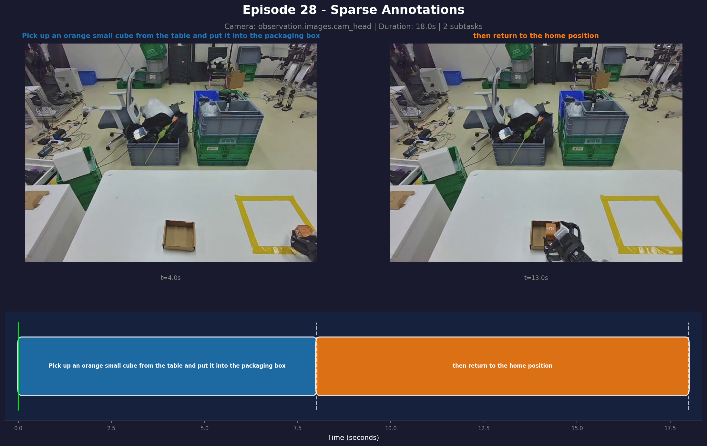
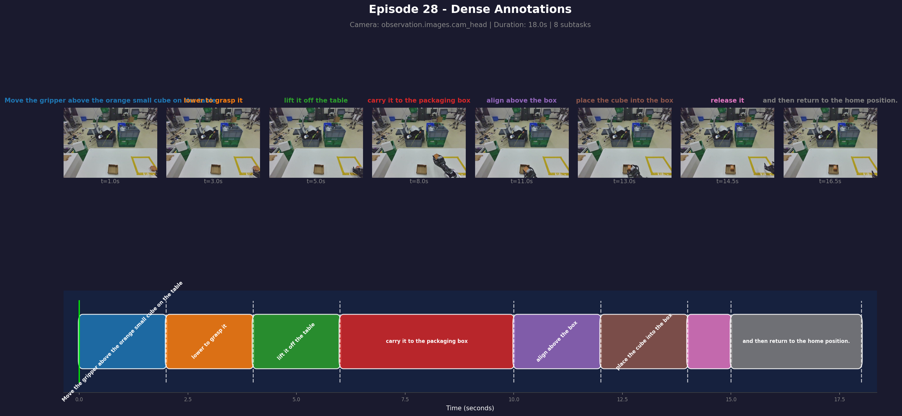
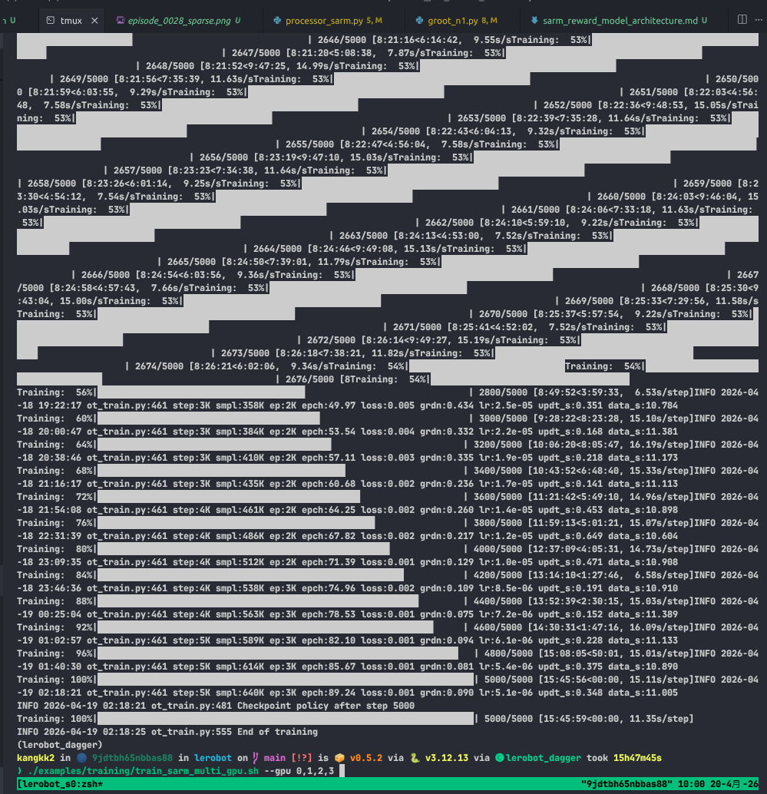
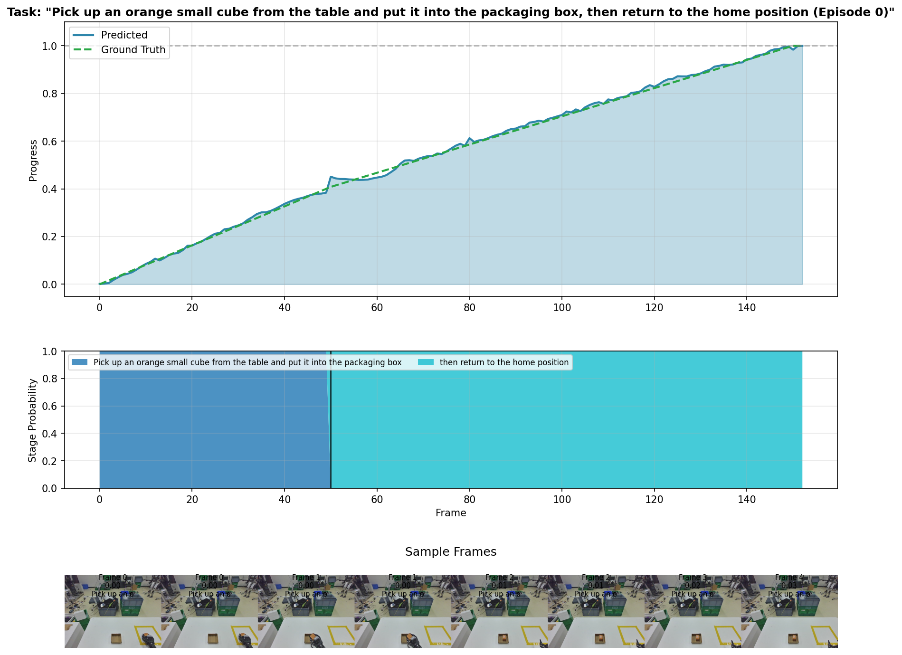

# 模型架构
## 0) SARM 模型缩减图（类似论文总览风格）

只保留 `SARMRewardModel` 内部最核心的两部分：`StageTransformer` 和 `SubtaskTransformer`。

```mermaid
graph LR
    subgraph Inputs["Inputs"]
        V["Video Embeddings<br/>B x T x 512"]
        L["Text Embeddings<br/>B x 512 或 B x T x 512"]
        S["State Features<br/>B x T x 32"]
        LEN["Valid Lengths<br/>B"]
    end

    PRE["预处理/重排<br/>img_seq = video.unsqueeze(1)<br/>B x 1 x T x 512<br/>state pad 到 max_state_dim"]

    subgraph StageTower["StageTransformer（阶段判别）"]
        ST_IN["输入<br/>img_seq + lang + state + lengths"]
        ST_CORE["主作用<br/>预测当前帧属于哪个 stage"]
        ST_OUT["输出<br/>stage_logits: B x T x C<br/>stage_probs: B x T x C<br/>stage_idx: B x T"]
    end

    BRIDGE["Stage Bridge<br/>stage_idx -> one_hot -> stage_emb<br/>B x 1 x T x C"]

    subgraph SubtaskTower["SubtaskTransformer（阶段内进度回归）"]
        SU_IN["输入<br/>img_seq + lang + state + lengths + stage_emb"]
        SU_CORE["主作用<br/>在当前 stage 内回归 tau"]
        SU_OUT["输出<br/>tau_pred: B x T（范围 [0,1]）"]
    end

    REWARD["Reward Compose<br/>raw = stage_idx + tau_pred<br/>normalize_stage_tau -> reward in [0,1]"]
    FINAL["最终输出<br/>单帧或全帧 reward<br/>可选返回 stage_probs/confidence"]

    V --> PRE
    L --> PRE
    S --> PRE
    LEN --> PRE
    PRE --> ST_IN --> ST_CORE --> ST_OUT --> BRIDGE --> SU_IN --> SU_CORE --> SU_OUT --> REWARD --> FINAL

    classDef input fill:#e1f5fe,stroke:#01579b,stroke-width:2px
    classDef stage fill:#fff4e1,stroke:#e65100,stroke-width:2px
    classDef subtask fill:#f3e5f5,stroke:#6a1b9a,stroke-width:2px
    classDef out fill:#e8f5e9,stroke:#2e7d32,stroke-width:2px

    class V,L,S,LEN input
    class ST_IN,ST_CORE,ST_OUT stage
    class SU_IN,SU_CORE,SU_OUT subtask
    class REWARD,FINAL out
```



### 缩减图解读（只看核心）

- `StageTransformer`：输入是视觉/语言/状态序列，输出每一帧所属阶段分布（`stage_probs`）与阶段索引（`stage_idx`）。
- `SubtaskTransformer`：在 `stage_emb` 条件下回归每一帧阶段内进度 `tau_pred`，表示“在当前阶段完成到哪里”。
- 最终 reward：`stage_idx + tau_pred` 后再做 `normalize_stage_tau`，得到范围 `[0,1]` 的可比较进度值。
- 这个结构对应代码里的主推理路径：`calculate_rewards()` 内先跑 `stage_model`，再构建 `stage_emb`，再跑 `subtask_model`，最后归一化输出。

## 默认配置速览（来自 `SARMConfig`）

- `image_dim=512`, `text_dim=512`, `hidden_dim=768`
- `num_layers=8`, `num_heads=12`, `dropout=0.1`
- `n_obs_steps=8`, `max_rewind_steps=4`, 所以 `num_frames=13`
- `max_state_dim=32`
- 主网络共 2 个：`StageTransformer` + `SubtaskTransformer`


# 环境安装命令
* 补充环境安装命令
```bash
conda create -y -n lerobot_dagger python=3.12
conda activate lerobot_dagger

conda install ffmpeg 
pip3 install -e .
pip install 'lerobot[dataset]'
pip install 'lerobot[sarm]'
python -m pip install -U qwen-vl-utils
pip3 install matplotlib 
pip install httpx[socks]
pip install accelerate  
pip install faker
pip install wandb
pip install pyarrow
pip3 install pydantic

```
# 整体工作流：
总体工作流
1. Annotate (sparse+dense) → 
2. Verify → 
3. Train SARM → 
4. Visualize → 
5. (Optional) Train policy with RA-BC

# 命令说明：
## Step 1: Annotate 实验记录说明
- 分类标注所使用的VLM标注为，*Qwen3-VL-30B-A3B-Instruct*进行标注
[图片]
- 补充环境
  - conda install -c conda-forge ffmpeg -y
  - python -m pip install -U qwen-vl-utils
  - pip3 install matplotlib 
  - pip install faker
  - pip install wandb

- 进行标注
```bash
export DISABLE_TRANSFORMERS_CACHING_ALLOCATOR=1
export PYTORCH_CUDA_ALLOC_CONF=expandable_segments:True

python3 src/lerobot/data_processing/sarm_annotations/subtask_annotation.py \
  --repo-id /home/kangkk2/lerobot/lerobot_dataset/0415_pick_cube_single_s62_real_clawAsS-filtered \
  --sparse-subtasks "Pick up an orange small cube from the table and put it into the packaging box, then return to the home position" \
  --dense-subtasks "Move the gripper above the orange small cube on the table, lower to grasp it, lift it off the table, carry it to the packaging box, align above the box, place the cube into the box, release it, and then return to the home position." \
  --video-key observation.images.cam_head \
  --device auto \
  --num-workers 1 \
  --dtype float16
```
## Step 2:  Verify Annotations 子任务标注
- 只可视化 使用 --visualize-only 标记可视化注释
```bash
python3 src/lerobot/data_processing/sarm_annotations/subtask_annotation.py \
  --repo-id /home/kangkk2/lerobot/lerobot_dataset/0415_pick_cube_single_s62_real_clawAsS-filtered \
  --video-key observation.images.cam_head \
  --visualize-only \
  --visualize-type both \
  --num-visualizations 5 \
  --output-dir ./subtask_viz
```
- 标注后的结果



## Step 3: 开始训练模型
- 4卡5880，48G，batch=32，默认训练时长需12h 
```bash
./examples/training/train_sarm_multi_gpu.sh --gpu 0,1,2,3
```
- 训练模型后进行visualize可视化进度预测


## Step 4: Visualize Predictions
- sparse reward
```bash
PYTHONPATH=src python -m lerobot.policies.sarm.compute_rabc_weights \
  --dataset-repo-id /home/kangkk2/lerobot/lerobot_dataset/0415_pick_cube_single_s62_real_clawAsS-filtered \
  --reward-model-path /home/kangkk2/lerobot/outputs/train/sarm_dual_20260418_103135/checkpoints/005000/pretrained_model \
  --visualize-only \
  --num-visualizations 1 \
  --head-mode sparse \
  --output-dir /home/kangkk2/lerobot/sarm_viz \
  --save-mp4 \
  --mp4-fps 20
```


- dense reward
```bash
PYTHONPATH=src python -m lerobot.policies.sarm.compute_rabc_weights \
  --dataset-repo-id /home/kangkk2/lerobot/lerobot_dataset/0415_pick_cube_single_s62_real_clawAsS-filtered \
  --reward-model-path /home/kangkk2/lerobot/outputs/train/sarm_dual_20260418_103135/checkpoints/005000/pretrained_model \
  --visualize-only \
  --num-visualizations 1 \
  --head-mode both \  
  --output-dir /home/kangkk2/lerobot/sarm_viz \
  --save-mp4 \
  --mp4-fps 20 
```

## Step 5: Train Policy with RA-BC
### 5a: Compute SARM Progress Values